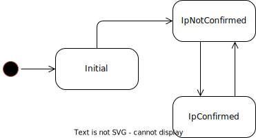

# Client Internals

## State
The client uses the state pattern to handle state changes in a reliable way. There's only three valid states as the following overview shows.

### States Reference
| Name           | Description                                                                                                                                                   | Transitions                                                                                                                                                           |
|----------------|---------------------------------------------------------------------------------------------------------------------------------------------------------------|-----------------------------------------------------------------------------------------------------------------------------------------------------------------------|
| Initial        | Initial state before it's known whether the DNS record matches the IP address                                                                                 | Transitions to `IpNotConfirmed` state.                                                                                                                                |
| IpNotConfirmed | The application transitions and remains in this state as long as the DNS record does not correspond to the detected public IP address                         | Transitions to `IpConfirmed`state when the configured DNS record resolves to the detected public IP address.                                                          |
| IpConfirmed    | Contrary to `IpNotConfirmed`, the application transitions and remains in this state as long as the DNS record corresponds to the detected public IP address.  | Transitions to `IpNotConfirmedState` either when a new public IP update is detected or when the configured DNS record does not match the detected IP address anymore. |

## Failure Scenarios

| Scenario                                               | Impact                                               | Mitigation                                                                                                                                                                           |
|--------------------------------------------------------|------------------------------------------------------|--------------------------------------------------------------------------------------------------------------------------------------------------------------------------------------|
| Update request could not be dispatched successfully    | DNS record can not be updated to detected IP address | Continuously reconciliate pending update requests in the background until they are successfully delivered                                                                            |
| DNS record drift through (mistakenly) 3rd party change | DNS record does not match public IP address anymore  | Do not only detect IP updates, also detect that a DNS record does not match public IP address any longer                                                                             |
| HTTP IP provider is down                               | Public IP address can not be determined anymore      | Multiple IP address API providers can (and should) be configured. It's possible to set preferred resolvers (e.g. self-hosted ones) and keep a list of public ones (e.g. ifconfig.me) |
| Dyndns server component is not reachable               | DNS update request can not be sent                   | Multiple server endpoints can be provided at the same time (both multiple MQTT servers and multiple HTTP endpoints)                                                                  |
